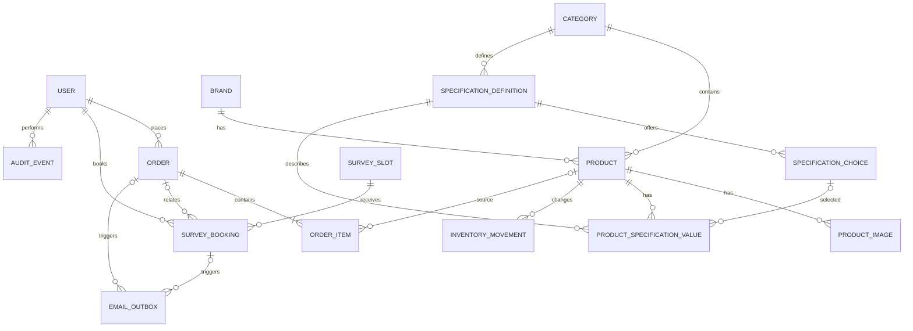

# OctaCam Architecture Specification

**Status:** Final MVP architecture  
**Project:** OctaCam CCTV E-commerce Platform  
**Market:** Pakistan  
**Primary stack:** React + React Router Framework Mode, Django + Django REST Framework, PostgreSQL, REST, JWT  
**Companion documents:** `product-spec.md`, `ux-spec.md`, `agents.md`, `README.md`

---

## 1. Purpose

This document defines how the OctaCam MVP is implemented technically.

`product-spec.md` defines **what the product must do**.  
`ux-spec.md` defines **how customers and staff experience it**.  
This file defines **how the system is structured, how data is stored, how APIs behave, how security and transactions work, and how the application is deployed and tested**.

If an implementation request conflicts with `product-spec.md` or `ux-spec.md`, the implementation must not silently override them. The conflict must be resolved deliberately and the affected specification updated.

This architecture is intentionally designed as a **simple production-appropriate modular monolith**. It avoids infrastructure and abstractions that do not solve a current MVP requirement.

---

## 2. Architecture goals

The architecture must support the following product properties:

1. Public CCTV catalog with brands, categories, accurate product specifications, prices, stock, warranty information, and search/filtering.
2. Guest and registered-customer checkout.
3. Cash on delivery as the only MVP equipment payment method.
4. Server-authoritative price, tax, shipping, and stock validation.
5. Concurrency-safe ordering so stock cannot be oversold.
6. Free Lahore site-survey booking with concurrency-safe slot capacity.
7. Survey booking either standalone or together with an order.
8. Secure guest tracking for orders and survey bookings.
9. Staff product, inventory, order, and survey management.
10. Immutable historical order snapshots.
11. Reliable transactional email that cannot invalidate a successful order or booking.
12. Search-engine discoverable product, category, brand, and help pages.
13. Responsive, accessible customer and staff interfaces.
14. Strong separation between customer UI behavior and server-side business rules.
15. A codebase that is understandable, testable, maintainable, and explainable in a software-engineering interview.

---

## 3. Architectural principles

### 3.1 Modular monolith

OctaCam uses:

- one React application,
- one Django/DRF backend,
- one PostgreSQL database.

The backend is separated into domain-focused Django apps, but it is deployed as one application.

Do **not** introduce microservices for the MVP.

### 3.2 PostgreSQL is the business authority

The browser must never be authoritative for:

- product prices,
- sale prices,
- stock,
- tax,
- shipping,
- order totals,
- survey availability,
- permissions,
- order state,
- payment state.

React may display cached or previously loaded values, but Django must validate authoritative values before committing business actions.

### 3.3 Explicit business workflows

Important workflows must be implemented explicitly through services.

Critical behavior must **not** be hidden inside Django signals.

Examples:

- checkout,
- stock decrement,
- cancellation/restocking,
- survey booking,
- survey rescheduling,
- order state changes,
- email outbox creation,
- audit events.

### 3.4 Transactions around business invariants

Database transactions and row locks are required where concurrent requests could violate correctness.

Important examples:

- purchasing the last unit,
- booking the last survey capacity,
- cancelling and restocking,
- moving a survey booking to another slot.

### 3.5 Prefer simple infrastructure

The MVP does not need Redis, Celery, Elasticsearch, Kafka, GraphQL, Kubernetes, or microservices.

New infrastructure may only be added later when a real requirement justifies it.

---

# 4. System overview

```text
                         INTERNET
                            |
                            v
                 +----------------------+
                 | Edge / CDN / TLS     |
                 | Reverse routing      |
                 +----------+-----------+
                            |
             +--------------+--------------+
             |                             |
        /api/v1/*                     everything else
             |                             |
             v                             v
     +---------------+              +---------------+
     | Django + DRF  |<-------------| React SSR     |
     | application   | internal API | Node runtime  |
     +-------+-------+              +---------------+
             |
      +------+------+----------------+
      |             |                |
      v             v                v
 PostgreSQL   Object storage    Email outbox worker
                                   |
                                   v
                              Email provider
```

Externally the site should appear as one origin:

```text
https://octacam.pk/
https://octacam.pk/products/...
https://octacam.pk/account/...
https://octacam.pk/staff/...

https://octacam.pk/api/v1/...
```

React and Django remain separate internal applications even though the browser sees one website.

The same-origin design reduces CORS complexity and simplifies cookie-based refresh-token security.

---

# 5. Repository structure

OctaCam uses a monorepo.

```text
octacam/
|
|-- frontend/
|-- backend/
|
|-- docs/
|   `-- decisions/
|
|-- product-spec.md
|-- ux-spec.md
|-- architecture.md
|-- agents.md
|-- README.md
|
|-- .github/
|   `-- workflows/
|
|-- .gitignore
`-- docker-compose.yml
```

`docs/decisions/` may contain architecture decision records when a future decision is substantial enough to document independently.

Do not create ADRs for trivial implementation details.

---

# 6. Frontend architecture

## 6.1 Technology

Frontend:

- React
- React Router Framework Mode
- TypeScript
- SSR for public dynamic catalog pages
- pre-rendering for suitable static content
- REST communication with Django

Exact package versions should be pinned in the project lockfile when implementation begins.

A large global state library is **not** required initially.

Redux must not be introduced unless a later implementation requirement clearly justifies it.

---

## 6.2 Frontend folder structure

```text
frontend/
|
|-- app/
|   |-- root.tsx
|   |-- routes.ts
|   |
|   |-- routes/
|   |   |-- home.tsx
|   |   |-- shop.tsx
|   |   |-- search.tsx
|   |   |-- brands.$brandSlug.tsx
|   |   |-- categories.$categorySlug.tsx
|   |   |-- products.$productSlug.tsx
|   |   |
|   |   |-- cart.tsx
|   |   |-- checkout.tsx
|   |   |
|   |   |-- orders.track.$token.tsx
|   |   |-- surveys.tsx
|   |   |-- surveys.track.$token.tsx
|   |   |
|   |   |-- login.tsx
|   |   |-- register.tsx
|   |   |-- forgot-password.tsx
|   |   |-- reset-password.tsx
|   |   |
|   |   |-- account.tsx
|   |   |-- account.orders.tsx
|   |   |-- account.orders.$id.tsx
|   |   |
|   |   |-- staff.tsx
|   |   |-- staff._index.tsx
|   |   |-- staff.products.tsx
|   |   |-- staff.products.new.tsx
|   |   |-- staff.products.$id.tsx
|   |   |-- staff.orders.tsx
|   |   |-- staff.orders.$id.tsx
|   |   |-- staff.survey-slots.tsx
|   |   |-- staff.survey-bookings.tsx
|   |   `-- staff.survey-bookings.$id.tsx
|   |
|   |-- features/
|   |   |-- auth/
|   |   |-- catalog/
|   |   |-- cart/
|   |   |-- checkout/
|   |   |-- orders/
|   |   |-- surveys/
|   |   `-- staff/
|   |
|   |-- components/
|   |   |-- ui/
|   |   `-- layout/
|   |
|   |-- lib/
|   |   |-- api/
|   |   |   |-- browser-client.ts
|   |   |   `-- server-client.ts
|   |   |-- auth/
|   |   |-- formatting/
|   |   `-- validation/
|   |
|   |-- content/
|   |   |-- banners.ts
|   |   `-- policies/
|   |
|   `-- styles/
|
|-- public/
|-- tests/
|-- react-router.config.ts
`-- package.json
```

Route files own route-level responsibilities.

Reusable domain behavior belongs under `features/`.

Reusable generic UI belongs under `components/`.

Do not place major business logic directly inside route components.

---

# 7. Frontend rendering strategy

## 7.1 Runtime SSR

The following public dynamic pages should use runtime server-side rendering:

- homepage,
- brand pages,
- category pages,
- product pages,
- survey information/booking entry page,
- search results.

Product pages must not be permanently generated at build time because price, stock, publication state, and sale state may change.

## 7.2 Pre-rendered content

Static or rarely changing content may be pre-rendered:

- About,
- Contact shell where appropriate,
- Shipping policy,
- Returns policy,
- Warranty policy,
- Privacy,
- Terms.

Static banner configuration may be shipped with frontend content/deployment because the UX specification deliberately excludes a staff banner CMS in the MVP.

## 7.3 Private/client-heavy pages

These pages are primarily authenticated or browser-state driven:

- cart,
- checkout,
- login/register,
- account,
- order history,
- guest order tracking,
- guest survey tracking,
- staff dashboard.

Private pages must not depend on search-engine indexing.

---

# 8. Frontend state ownership

| State | Owner |
|---|---|
| Product/category/brand page data | React Router loader |
| Search/filter/sort | URL search parameters |
| Cart | Cart context/reducer + `localStorage` |
| Access token | In-memory auth store |
| Current authenticated user | Auth store |
| Checkout form | Route/form state |
| Dialog/menu state | Component state |
| Product price | Django |
| Stock | Django |
| Tax and shipping | Django |
| Orders | Django |
| Survey capacity | Django |
| Staff permissions | Django |

Do not duplicate authoritative backend state into a long-lived global frontend store without a real requirement.

---

# 9. Cart architecture

The MVP cart is local to the browser.

Persist only:

```json
[
  {
    "product_id": 42,
    "quantity": 2
  }
]
```

Do not persist authoritative price or stock in cart storage.

There are no MVP database tables for:

- `Cart`,
- `CartItem`,
- guest cart tokens,
- cart merging,
- cart expiration.

Logging in does not create a special cart merge flow. The browser cart simply remains available.

Stock is not reserved when an item is placed in the cart.

Checkout is the point at which Django validates all current values.

---

# 10. Frontend API clients

SSR and browser requests require separate clients.

### Browser client

Uses same-origin paths:

```text
/api/v1/catalog/products/
```

Responsibilities include:

- Authorization bearer token,
- CSRF header where required,
- normalized API errors,
- single-flight token refresh,
- retrying the original request once after successful refresh.

### Server client

SSR loaders may call an internal backend URL:

```text
http://backend-internal:8000/api/v1/...
```

when the deployment platform provides internal/private service networking.

Public browser traffic should still use `/api/v1/...`.

---

# 11. Authentication architecture

## 11.1 User model

Create a custom user model from the first Django migration.

Suggested fields:

```text
User
----
id
email
password
full_name
phone
is_active
is_staff
date_joined
last_login
```

Email is the login identifier.

No username is required.

The MVP has one staff permission level, represented by `is_staff`.

---

## 11.2 JWT strategy

Authentication uses:

```text
short-lived access JWT
+
rotating refresh JWT
```

Access token:

- returned in response JSON,
- stored in frontend memory only,
- sent as `Authorization: Bearer ...`.

Refresh token:

- stored in an `HttpOnly` cookie,
- `Secure` in production,
- scoped to authentication endpoints,
- rotated on refresh,
- previously used refresh token blacklisted.

Refresh tokens must not be stored in `localStorage`.

---

## 11.3 Login flow

```text
React
  |
  | POST /api/v1/auth/login/
  v
Django
  |
  | authenticate credentials
  |
  +--> access JWT -> response JSON
  |
  `--> refresh JWT -> HttpOnly cookie
```

---

## 11.4 Session restoration

Because the access token exists only in memory, a full browser reload loses it.

On application startup where authenticated state is required:

```text
POST /api/v1/auth/refresh/
```

The refresh cookie is sent automatically.

A successful refresh:

1. validates the refresh token,
2. blacklists the old refresh token,
3. issues a new refresh token cookie,
4. returns a new access token,
5. restores the current user state.

---

## 11.5 Single-flight refresh

If multiple requests receive `401` simultaneously, the frontend must perform only one refresh request.

All failed requests wait for the same refresh promise.

After a successful refresh they retry once with the new access token.

This avoids race conditions caused by refresh-token rotation.

---

## 11.6 Logout

```text
POST /api/v1/auth/logout/
```

Backend:

- blacklist refresh token,
- delete refresh cookie.

Frontend:

- remove access token from memory,
- clear authenticated user state.

Cart state remains.

---

## 11.7 CSRF

Bearer access-token requests are not authenticated by an automatically attached auth cookie.

However, refresh and logout use an HttpOnly cookie.

Cookie-authenticated authentication endpoints must therefore use CSRF protection in addition to same-origin and `SameSite` controls.

The frontend may bootstrap a CSRF token via:

```text
GET /api/v1/auth/csrf/
```

and include it on cookie-authenticated state-changing requests.

The backend also requires this CSRF header on registration and login because those endpoints set the refresh cookie.

---

## 11.8 Password reset

Required endpoints:

```text
POST /api/v1/auth/password-reset/request/
POST /api/v1/auth/password-reset/confirm/
```

The request endpoint must return a neutral response regardless of whether the supplied email exists.

Reset links use a time-limited signed/one-time token.

---

# 12. Backend architecture

## 12.1 Django app structure

```text
backend/
|
|-- manage.py
|
|-- config/
|   |-- urls.py
|   |-- wsgi.py
|   `-- settings/
|       |-- base.py
|       |-- local.py
|       |-- test.py
|       `-- production.py
|
|-- apps/
|   |
|   |-- accounts/
|   |   |-- models.py
|   |   |-- services.py
|   |   |-- selectors.py
|   |   |-- api/
|   |   |   |-- serializers.py
|   |   |   |-- views.py
|   |   |   `-- urls.py
|   |   |-- migrations/
|   |   `-- tests/
|   |
|   |-- catalog/
|   |   |-- models.py
|   |   |-- services.py
|   |   |-- selectors.py
|   |   |-- filters.py
|   |   |-- api/
|   |   |-- migrations/
|   |   `-- tests/
|   |
|   |-- orders/
|   |   |-- models.py
|   |   |-- services.py
|   |   |-- pricing.py
|   |   |-- selectors.py
|   |   |-- api/
|   |   |-- migrations/
|   |   `-- tests/
|   |
|   |-- surveys/
|   |   |-- models.py
|   |   |-- services.py
|   |   |-- selectors.py
|   |   |-- api/
|   |   |-- migrations/
|   |   `-- tests/
|   |
|   |-- audit/
|   |   |-- models.py
|   |   |-- services.py
|   |   `-- tests/
|   |
|   |-- communications/
|   |   |-- models.py
|   |   |-- services.py
|   |   |-- email.py
|   |   |-- management/
|   |   `-- tests/
|   |
|   `-- core/
|       |-- exceptions.py
|       |-- permissions.py
|       |-- references.py
|       |-- signing.py
|       `-- api/
|           `-- exception_handler.py
|
`-- tests/
    `-- integration/
```

---

# 13. Backend layering

## 13.1 API layer

DRF views are responsible for:

- HTTP request parsing,
- serializer validation,
- authentication/permission checks,
- calling a service or selector,
- returning an HTTP response.

Views must not contain large multi-model business workflows.

## 13.2 Serializers

Serializers are responsible for:

- API shape,
- input validation,
- output representation.

Serializers should not become the primary business-service layer.

## 13.3 Selectors

Selectors are read-oriented functions.

Examples:

```text
get_public_products(...)
get_product_by_slug(...)
get_customer_orders(...)
get_available_survey_slots(...)
```

## 13.4 Services

Services perform business-changing workflows.

Examples:

```text
place_order(...)
cancel_order(...)
adjust_stock(...)
book_survey(...)
reschedule_survey(...)
mark_cod_collected(...)
```

## 13.5 ORM

Django ORM is the persistence abstraction.

Do not create a generic repository layer such as:

```text
ProductRepository
OrderRepository
SurveyRepository
```

unless a future requirement proves it necessary.

---

# 14. Service boundaries

Major business services:

```text
AccountService
CatalogService
InventoryService
PricingService
CheckoutService
OrderService
SurveyService
AuditService
EmailOutboxService
```

Responsibilities:

| Service | Responsibility |
|---|---|
| AccountService | Registration and account/password operations |
| CatalogService | Product, brand, category and specification mutations |
| InventoryService | Stock adjustments and inventory movement history |
| PricingService | Selling price, shipping, tax, totals |
| CheckoutService | Order-placement orchestration |
| OrderService | Order state, courier, COD collection, cancellation |
| SurveyService | Slot capacity, booking, rescheduling, status |
| AuditService | Audit-event creation |
| EmailOutboxService | Transactional email events and delivery state |

`CheckoutService` is intentionally an orchestrator because checkout crosses catalog, inventory, orders, surveys, audit, and communications.

---

# 15. Critical workflow rule: no hidden signals

Do not implement critical commerce behavior using `post_save`/`pre_save` signal chains.

Bad example:

```text
Order created
 -> signal
 -> stock decrement
 -> another signal
 -> email
```

Preferred:

```text
CheckoutService.place_order()
 -> validate
 -> transaction
 -> create order
 -> create items
 -> decrement stock
 -> inventory movement
 -> optional survey
 -> audit
 -> email outbox
```

The entire business transaction must be visible when reading the workflow service.

---

# 16. Data model overview

Core tables:

```text
accounts
--------
User


catalog
-------
Brand
Category
Product
ProductImage
SpecificationDefinition
SpecificationChoice
ProductSpecificationValue
InventoryMovement


orders
------
Order
OrderItem


surveys
-------
SurveySlot
SurveyBooking


operations
----------
AuditEvent
EmailOutbox
```

The MVP intentionally has no database models for:

- server cart,
- product variants,
- bundles/kits,
- reviews,
- wishlist,
- coupons,
- online payments,
- banner CMS,
- installation jobs,
- courier integration,
- general CMS.

---

# 17. ERD



---

# 18. Identifier strategy

Internal database primary keys may use Django `BigAutoField`.

Customer-facing business resources must not depend on sequential IDs.

### Product

Uses a stable slug in public URLs:

```text
/products/hikvision-ds-2ce16d0t-itp/
```

### Order

Suggested identity fields:

```text
id            internal PK
public_id     UUID
reference     human-friendly unique reference
```

Example customer reference:

```text
OC-26-A7K39P
```

### Survey booking

Suggested reference:

```text
OS-26-H42KM9
```

The exact reference-generation implementation belongs in `core/references.py`.

---

# 19. Brand

Suggested fields:

```text
Brand
-----
id
name
slug
description
is_active
sort_order
created_at
updated_at
```

Constraints:

```text
name UNIQUE
slug UNIQUE
```

Inactive brands do not appear publicly.

Prefer deactivation over deleting a brand referenced by products or historical data.

---

# 20. Category

Suggested fields:

```text
Category
--------
id
name
slug
description
is_active
sort_order
created_at
updated_at
```

The launch architecture assumes a flat category taxonomy.

Category names and slugs are unique, as for brands. Both taxonomy APIs require an explicit slug when creating an entry; editing its name does not change its slug. Names and slugs allow up to 120 characters. Staff may explicitly edit a slug, which changes the public API URL. Deactivation uses `PATCH` with `is_active: false`; public lists omit the entry and public detail requests return 404. Staff lists retain inactive entries. No hard-delete endpoint is exposed.

Do not introduce recursive parent/child categories until a real catalog requirement needs them.

---

# 21. Product

Suggested fields:

```text
Product
-------
id
brand_id
category_id

sku
slug
name

short_description
full_description

regular_price
sale_price

stock_quantity

warranty_text
is_published

created_at
updated_at
```

Money uses decimal/numeric database types, never floating point.

Suggested constraints:

```text
sku UNIQUE
slug UNIQUE

stock_quantity >= 0
regular_price >= 0

sale_price IS NULL
OR (
    sale_price >= 0
    AND sale_price < regular_price
)
```

Current selling price is derived:

```text
sale_price if valid sale exists
otherwise regular_price
```

Do not duplicate selling price into another mutable database column.

Draft product writes use staff-only `POST` and `PATCH` endpoints. SKU values are trimmed and normalized to uppercase, slugs are normalized to lowercase, and both are case-insensitively unique. Prices use `numeric(12, 2)`, supporting PKR values through `9,999,999,999.99`. Draft creation always sets `is_published` to false and `stock_quantity` to zero; the draft API rejects attempts to change either field. Images, publication commands, and inventory adjustments remain separate later slices.

Changing `regular_price` or `sale_price` creates one `PRODUCT_PRICE_CHANGED` audit event in the same transaction. The event stores the staff actor, product ID, timestamp, and before/after prices as decimal strings. Creating a draft does not count as a price change, and edits that leave both price fields unchanged do not create an event.

---

# 22. Product images

```text
ProductImage
------------
id
product_id
image
alt_text
sort_order
created_at
```

Suggested constraint:

```text
UNIQUE(product_id, sort_order)
```

The lowest sort order acts as the primary image.

Avoid separate `is_primary` state unless a later requirement needs it.

Database records store media references/keys; binary image data belongs in object storage.

---

# 23. Dynamic technical specifications

CCTV categories have different technical properties, so technical fields must not be hardcoded directly into `Product`.

Example camera attributes:

- resolution,
- lens,
- IR distance,
- microphone,
- indoor/outdoor,
- sensor.

Example storage attributes:

- capacity,
- interface,
- form factor,
- workload rating.

The architecture uses a lightweight typed specification system.

---

## 23.1 SpecificationDefinition

```text
SpecificationDefinition
-----------------------
id
category_id

key
label
data_type
unit

is_required
is_filterable
is_displayed
is_active

sort_order
created_at
updated_at
```

Allowed types:

```text
text
integer
decimal
boolean
choice
```

Constraint:

```text
UNIQUE(category_id, key)
```

Example:

```text
category       Cameras
key            resolution
label          Resolution
data_type      choice
is_required    true
is_filterable  true
is_displayed   true
```

---

## 23.2 SpecificationChoice

Used for controlled categorical values.

```text
SpecificationChoice
-------------------
id
definition_id
value
label
is_active
sort_order
```

Example choices:

```text
2mp
4mp
5mp
8mp
```

Controlled choices prevent duplicate filter values such as:

```text
2MP
2 mp
2 megapixel
```

---

## 23.3 ProductSpecificationValue

```text
ProductSpecificationValue
-------------------------
id
product_id
definition_id

text_value
integer_value
decimal_value
boolean_value
choice_id
```

Constraint:

```text
UNIQUE(product_id, definition_id)
```

Only the value column corresponding to `SpecificationDefinition.data_type` may be populated.

The service layer must validate:

1. definition belongs to the same category as the product,
2. provided type matches the definition,
3. a selected choice belongs to that definition,
4. required definitions are satisfied before publishing,
5. duplicate definition values are rejected.

---

# 24. Specification filtering

Filter behavior is driven by metadata rather than product-specific React code.

Supported filter types:

- choice,
- boolean,
- numeric range where appropriate.

Examples:

```text
Resolution = 4 MP
Indoor/outdoor = Outdoor
IR distance = 20-50 m
Storage capacity = 2-8 TB
```

React receives available filters from the backend and renders appropriate controls.

Technical filters must only be returned for the relevant active category/scope.

---

# 25. Inventory

Current stock is kept directly on `Product.stock_quantity` for efficient reads.

Inventory history is stored separately.

```text
InventoryMovement
-----------------
id
product_id
quantity_delta
reason
order_id nullable
actor_id nullable
note nullable
created_at
```

Initial reasons:

```text
manual_adjustment
order_placed
order_cancelled
```

Example:

```text
stock before: 10
order quantity: 2
movement: -2
stock after: 8
```

Manual staff stock changes must go through `InventoryService` rather than a generic field patch.

---

# 26. Order model

Suggested fields:

```text
Order
-----
id
public_id
reference

user_id nullable

customer_name
customer_email
customer_phone

delivery_address_line1
delivery_address_line2 nullable
delivery_city
delivery_province
delivery_postal_code nullable
delivery_country

status
payment_method
payment_status

subtotal
tax_total
shipping_fee
grand_total

courier_name nullable
tracking_number nullable
tracking_url nullable

idempotency_key
request_fingerprint

guest_link_nonce

placed_at
updated_at
cancelled_at nullable
```

Guest order:

```text
user_id = NULL
```

Signed-in order:

```text
user_id = authenticated user
```

Historical guest orders must not be automatically attached to an account created later.

---

# 27. Order states

Order status:

```text
placed
confirmed
packed
shipped
delivered
cancelled
```

Payment method:

```text
COD
```

COD payment status:

```text
uncollected
collected
```

Order state and payment state are intentionally independent.

Never infer:

```text
delivered == collected
```

---

# 28. Order item snapshot

```text
OrderItem
---------
id
order_id

product_id nullable

product_name
sku

quantity

unit_price
line_subtotal
tax_amount

created_at
```

Order item fields are snapshots.

Later changes to:

- product name,
- SKU,
- price,
- publication,
- product deletion/deactivation,

must not change historical order records.

`product_id` may be nullable to preserve the snapshot independently from the current catalog record.

---

# 29. Pricing snapshot

Order stores:

```text
subtotal
tax_total
shipping_fee
grand_total
```

Each item stores:

```text
unit_price
quantity
line_subtotal
tax_amount
```

Exact tax rules and shipping values are pre-launch business configuration.

Do not hardcode an assumed Pakistani tax rate.

The architecture should expose pricing through a dedicated `PricingService`.

---

# 30. Idempotency

Checkout and standalone survey booking require idempotency protection.

Client sends:

```text
Idempotency-Key: <UUID>
```

The backend stores:

```text
idempotency_key UNIQUE
request_fingerprint
```

Behavior:

### First request

No matching key:

```text
perform operation
store key + fingerprint
return created resource
```

### Safe retry

Same key + same fingerprint:

```text
return the already-created resource
```

### Invalid key reuse

Same key + different fingerprint:

```text
409 IDEMPOTENCY_CONFLICT
```

This protects against double clicks, ambiguous network retries, and duplicate submissions.

---

# 31. Guest tracking tokens

Human-readable order/survey references are not authorization secrets.

Guest tracking uses long signed tokens.

Suggested design:

```text
raw token payload:
    public_id
    guest_link_nonce

Django signs payload cryptographically
```

The database stores the nonce but does not depend on the customer-facing reference for access control.

Changing the nonce invalidates previously issued links.

Guest tracking pages expose only the information needed for that resource.

They must never expose:

- internal notes,
- unrelated orders/bookings,
- staff-only audit history,
- full unnecessary personal information.

---

# 32. Survey slot

```text
SurveySlot
----------
id
public_id

starts_at
ends_at
capacity
is_open

created_by_id

created_at
updated_at
```

Constraint:

```text
capacity > 0
```

Store timezone-aware timestamps.

Display customer-facing survey time in `Asia/Karachi`.

Do not store a mutable `remaining_capacity` field.

Remaining availability is derived from slot capacity and non-cancelled bookings.

---

# 33. Survey booking

```text
SurveyBooking
-------------
id
public_id
reference

slot_id

user_id nullable
related_order_id nullable

customer_name
customer_email
customer_phone

site_address_line1
site_address_line2 nullable
site_area nullable
site_city

needs_description

status
internal_notes

idempotency_key
request_fingerprint

guest_link_nonce

created_at
updated_at
```

Statuses:

```text
confirmed
completed
cancelled
```

A successfully booked survey is confirmed immediately.

Standalone bookings have:

```text
related_order_id = NULL
```

Order and survey lifecycles remain independent.

Cancelling one must not silently cancel the other.

---

# 34. Survey guest tracking

A planning decision extends the guest-tracking concept to standalone and order-linked survey bookings.

Endpoint:

```text
GET /api/v1/surveys/track/{signed_token}/
```

May expose:

- booking reference,
- booking status,
- survey date/time,
- relevant site-address summary,
- customer-submitted needs description,
- related order reference where appropriate,
- support contact route.

Must not expose:

- internal notes,
- staff identity,
- audit history.

**Specification alignment note:** `product-spec.md` already says a guest can track a booking, while `ux-spec.md` does not yet define the later tracking screen explicitly. The UX specification should be updated to document this page before implementation is considered complete.

---

# 35. Audit events

Important staff changes require traceability.

```text
AuditEvent
----------
id
actor_id nullable

resource_type
resource_id

action

before_data JSONB
after_data JSONB
metadata JSONB

created_at
```

Initial audit actions include:

```text
PRODUCT_PRICE_CHANGED
PRODUCT_STOCK_CHANGED
PRODUCT_PUBLISHED
PRODUCT_UNPUBLISHED

ORDER_STATUS_CHANGED
ORDER_CANCELLED
COD_MARKED_COLLECTED
COURIER_UPDATED

SURVEY_SLOT_CREATED
SURVEY_SLOT_CHANGED
SURVEY_BOOKING_RESCHEDULED
SURVEY_BOOKING_CANCELLED
SURVEY_BOOKING_COMPLETED
```

Sensitive values such as passwords or tokens must never be placed into audit JSON.

---

# 36. Transactional email outbox

Successful orders/bookings must not depend on immediate availability of the email provider.

```text
EmailOutbox
-----------
id

event_type
recipient
template_name
context JSONB

order_id nullable
survey_booking_id nullable

dedupe_key UNIQUE

status
attempt_count
next_attempt_at

last_error nullable

created_at
sent_at nullable
```

Statuses:

```text
pending
sent
failed
```

Initial events include:

```text
ORDER_PLACED
ORDER_STATUS_CHANGED
SURVEY_CONFIRMED
SURVEY_CHANGED
SURVEY_CANCELLED
PASSWORD_RESET
```

Sensitive authentication secrets must not be stored in reusable plaintext outbox context longer than necessary.

---

# 37. Checkout architecture

Checkout uses two logical steps:

1. quote,
2. place.

---

## 37.1 Quote

```text
POST /api/v1/checkout/quote/
```

Input includes:

- product IDs,
- quantities,
- delivery location information required for pricing rules.

Backend:

1. loads current products,
2. validates publication,
3. validates quantities,
4. checks current stock,
5. calculates current selling price,
6. calculates business-approved tax,
7. calculates flat shipping,
8. returns current itemized totals,
9. creates a signed quote token/fingerprint.

The quote itself does not reserve stock.

---

## 37.2 Place order

```text
POST /api/v1/checkout/place/
```

Header:

```text
Idempotency-Key: <UUID>
```

Backend must not blindly trust the previous quote.

It recalculates all authoritative values.

If pricing or availability changed:

```text
409 CHECKOUT_CHANGED
```

with updated information for explicit customer review.

No order is created.

---

# 38. Concurrency-safe stock transaction

When placing an order:

```text
BEGIN

SELECT purchased Product rows
FOR UPDATE

recalculate pricing
validate stock

create Order
create OrderItems

decrement Product.stock_quantity
create InventoryMovements

create optional SurveyBooking
create AuditEvents
create EmailOutbox rows

COMMIT
```

If two customers attempt to buy the last unit:

1. first transaction locks the product,
2. first transaction commits stock to zero,
3. second transaction acquires the lock afterwards,
4. second transaction observes zero stock,
5. second checkout fails cleanly.

Overselling must not occur.

---

# 39. Order + survey combined checkout

If a shopper requests both equipment and a survey, initial creation belongs in one transaction.

```text
BEGIN

lock Product rows
lock SurveySlot

validate prices
validate stock
validate survey capacity

create Order
create OrderItems
decrement stock

create SurveyBooking

create inventory/audit/outbox rows

COMMIT
```

If the selected survey slot is no longer available:

```text
ROLLBACK
```

No order is created and no stock is changed.

The frontend preserves the form and requires another slot to be chosen before either requested action is committed.

After successful creation, order and survey become separate resources with separate lifecycles.

---

# 40. Survey capacity transaction

Survey booking:

```text
BEGIN

SELECT SurveySlot
FOR UPDATE

count non-cancelled bookings

if count >= capacity:
    fail

create SurveyBooking

COMMIT
```

Rescheduling must lock the booking and relevant old/new slots before checking destination capacity.

---

# 41. Order cancellation and restocking

Customer self-service cancellation is not part of the MVP.

Staff cancellation:

```text
POST /api/v1/staff/orders/{public_id}/cancel/
```

The service:

1. locks the order,
2. validates cancellation under the configured policy,
3. locks affected products,
4. changes the order to `cancelled`,
5. restores stock only when appropriate,
6. creates inventory movements,
7. creates audit events,
8. creates customer email outbox event,
9. commits once.

The same order must never restore stock twice.

---

# 42. REST API conventions

All application API endpoints are versioned:

```text
/api/v1/
```

Money values are serialized as decimal strings:

```json
"7999.00"
```

Do not send money as imprecise binary floating-point values.

---

# 43. Public catalog API

| Method | Endpoint | Purpose |
|---|---|---|
| GET | `/api/v1/catalog/brands/` | Active public brands |
| GET | `/api/v1/catalog/brands/{slug}/` | Brand landing data |
| GET | `/api/v1/catalog/categories/` | Active categories |
| GET | `/api/v1/catalog/categories/{slug}/` | Category landing data |
| GET | `/api/v1/catalog/products/` | Search/filter/sort products |
| GET | `/api/v1/catalog/products/{slug}/` | Product detail |
| GET | `/api/v1/catalog/filters/` | Filter metadata for scope |

Out-of-stock products remain visible publicly when published.

Unpublished products must not be returned from public endpoints.

---

# 44. Product search/filter contract

Example:

```text
GET /api/v1/catalog/products/
    ?q=ds-2ce
    &brand=hikvision
    &category=cameras
    &min_price=5000
    &max_price=20000
    &availability=in_stock
    &spec_resolution=2mp
    &spec_ir_distance_min=20
    &spec_ir_distance_max=50
    &sort=price_asc
    &page=1
```

Basic filters:

```text
q
brand
category
min_price
max_price
availability
```

Sort values:

```text
relevance
price_asc
price_desc
```

Dynamic specification query parameters are derived from active specification definitions.

Search should support product names and exact/partial model/SKU lookup.

PostgreSQL search/trigram indexing is sufficient for the MVP.

Do not introduce Elasticsearch initially.

---

# 45. Filter metadata endpoint

Example:

```text
GET /api/v1/catalog/filters/?category=cameras
```

Example response:

```json
{
  "brand": [
    {
      "value": "hikvision",
      "label": "Hikvision"
    }
  ],
  "price": {
    "min": "3500.00",
    "max": "85000.00"
  },
  "specifications": [
    {
      "key": "resolution",
      "label": "Resolution",
      "type": "choice",
      "options": [
        {
          "value": "2mp",
          "label": "2 MP"
        }
      ]
    },
    {
      "key": "ir_distance",
      "label": "IR Distance",
      "type": "decimal_range",
      "unit": "m",
      "min": "10",
      "max": "80"
    }
  ]
}
```

React builds filter controls from backend metadata.

---

# 46. Authentication API

```text
POST /api/v1/auth/register/
POST /api/v1/auth/login/
POST /api/v1/auth/refresh/
POST /api/v1/auth/logout/

GET  /api/v1/auth/csrf/

POST /api/v1/auth/password-reset/request/
POST /api/v1/auth/password-reset/confirm/
```

No social login in the MVP.

---

# 47. Customer account API

```text
GET   /api/v1/account/profile/
PATCH /api/v1/account/profile/

GET   /api/v1/account/orders/
GET   /api/v1/account/orders/{public_id}/
```

The profile GET returns the signed-in customer only. Staff use `GET /api/v1/staff/profile/` to retrieve their own staff identity; both routes enforce role permissions in Django.

A customer may retrieve only orders where:

```text
order.user == request.user
```

There is no customer cancellation endpoint.

---

# 48. Checkout API

```text
POST /api/v1/checkout/quote/
POST /api/v1/checkout/place/
```

Both guest and authenticated customers may use checkout.

Signed-in users may receive prefilled profile data, but checkout contact and delivery information remain explicitly reviewable/editable.

---

# 49. Guest order tracking API

```text
GET /api/v1/orders/track/{signed_token}/
```

Response may include:

- order reference,
- placed date,
- order status,
- COD status,
- item snapshots,
- total,
- courier/tracking details.

It must omit unnecessary private fields.

Invalid/forged links should return a neutral not-found path without confirming whether a different order exists.

---

# 50. Survey public API

```text
GET  /api/v1/surveys/slots/
POST /api/v1/surveys/bookings/

GET  /api/v1/surveys/track/{signed_token}/
```

`GET /surveys/slots/` returns only customer-relevant availability.

Do not expose operational capacity details that the UX does not require.

Standalone booking uses an idempotency key.

---

# 51. Staff catalog API

All staff endpoints require:

```text
authenticated user
AND
is_staff == true
```

Products:

```text
GET   /api/v1/staff/catalog/products/
POST  /api/v1/staff/catalog/products/
GET   /api/v1/staff/catalog/products/{id}/
PATCH /api/v1/staff/catalog/products/{id}/
```

Images:

```text
POST   /api/v1/staff/catalog/products/{id}/images/
PATCH  /api/v1/staff/catalog/product-images/{id}/
DELETE /api/v1/staff/catalog/product-images/{id}/
```

Brands:

```text
GET   /api/v1/staff/catalog/brands/
POST  /api/v1/staff/catalog/brands/
PATCH /api/v1/staff/catalog/brands/{id}/
```

Categories:

```text
GET   /api/v1/staff/catalog/categories/
POST  /api/v1/staff/catalog/categories/
PATCH /api/v1/staff/catalog/categories/{id}/
```

Specifications:

```text
GET   /api/v1/staff/catalog/categories/{id}/specifications/
POST  /api/v1/staff/catalog/categories/{id}/specifications/

PATCH /api/v1/staff/catalog/specifications/{id}/

POST  /api/v1/staff/catalog/specifications/{id}/choices/
PATCH /api/v1/staff/catalog/specification-choices/{id}/
```

Prefer deactivation/unpublishing over hard deletion for referenced catalog data.

---

# 52. Stock adjustment API

Stock changes must use an explicit command:

```text
POST /api/v1/staff/catalog/products/{id}/stock-adjustments/
```

Example:

```json
{
  "new_quantity": 17,
  "reason": "Physical stock count correction"
}
```

The service records:

- previous quantity,
- new quantity,
- delta,
- actor,
- reason,
- inventory movement,
- audit event.

Do not silently modify stock using a generic product PATCH.

---

# 53. Staff order API

```text
GET /api/v1/staff/orders/
GET /api/v1/staff/orders/{public_id}/
```

Filters may include:

```text
status
payment_status
search/reference
date
```

Consequential operations use explicit command endpoints.

Status transition:

```text
POST /api/v1/staff/orders/{public_id}/transition/
```

Courier:

```text
PATCH /api/v1/staff/orders/{public_id}/courier/
```

COD collection:

```text
POST /api/v1/staff/orders/{public_id}/mark-cod-collected/
```

Cancellation:

```text
POST /api/v1/staff/orders/{public_id}/cancel/
```

Do not expose one unrestricted generic order PATCH that can mutate all state.

---

# 54. Order state validation

Initial allowed progression:

```text
placed -> confirmed -> packed -> shipped -> delivered
```

`cancelled` is available only where business rules allow.

Invalid transitions return:

```text
409 INVALID_STATUS_TRANSITION
```

The service layer owns the state machine.

---

# 55. Staff survey API

Slots:

```text
GET  /api/v1/staff/surveys/slots/
POST /api/v1/staff/surveys/slots/

GET   /api/v1/staff/surveys/slots/{public_id}/
PATCH /api/v1/staff/surveys/slots/{public_id}/
```

Bookings:

```text
GET /api/v1/staff/surveys/bookings/
GET /api/v1/staff/surveys/bookings/{public_id}/
```

Reschedule:

```text
POST /api/v1/staff/surveys/bookings/{public_id}/reschedule/
```

Status:

```text
POST /api/v1/staff/surveys/bookings/{public_id}/transition/
```

Internal notes:

```text
PATCH /api/v1/staff/surveys/bookings/{public_id}/notes/
```

Internal notes are never returned from public tracking endpoints.

---

# 56. Staff operations API

Staff identity:

```text
GET /api/v1/staff/profile/
```

Dashboard summary:

```text
GET /api/v1/staff/overview/
```

May include:

- new orders,
- orders requiring action,
- upcoming survey bookings,
- failed transactional emails,
- recent activity.

Audit activity:

```text
GET /api/v1/staff/activity/
```

Transactional email operations:

```text
GET  /api/v1/staff/communications/emails/
POST /api/v1/staff/communications/emails/{id}/retry/
```

The MVP does not require a broad analytics system.

---

# 57. Standard error contract

All application API errors should follow one predictable structure.

```json
{
  "error": {
    "code": "SURVEY_SLOT_UNAVAILABLE",
    "message": "That survey slot is no longer available.",
    "fields": {}
  }
}
```

Validation example:

```json
{
  "error": {
    "code": "VALIDATION_ERROR",
    "message": "Some fields need attention.",
    "fields": {
      "phone": [
        "Enter a valid phone number."
      ]
    }
  }
}
```

Frontend behavior must branch on stable error `code`, not English message text.

---

# 58. Important HTTP statuses

```text
200 OK
201 Created
204 No Content

400 VALIDATION_ERROR
401 AUTHENTICATION_REQUIRED
403 PERMISSION_DENIED
404 NOT_FOUND

409 CHECKOUT_CHANGED
409 OUT_OF_STOCK
409 SURVEY_SLOT_UNAVAILABLE
409 INVALID_STATUS_TRANSITION
409 IDEMPOTENCY_CONFLICT

413 FILE_TOO_LARGE
415 UNSUPPORTED_MEDIA_TYPE
429 RATE_LIMITED
```

A `409` is appropriate when the request shape is valid but current application state prevents the operation.

---

# 59. API documentation

The backend must publish an OpenAPI schema from the start.

Recommended tooling:

```text
drf-spectacular
```

Endpoints:

```text
/api/schema/
/api/docs/
```

Document:

- request bodies,
- response bodies,
- auth requirements,
- query parameters,
- pagination,
- error responses,
- examples where useful.

Generated TypeScript types may be added later after the API stabilizes.

Do not require a generated API client for the first implementation.

---

# 60. Pagination

List endpoints that can grow must be paginated.

Initial examples:

- public product lists,
- account order history,
- staff product list,
- staff order list,
- staff booking list,
- staff audit activity,
- staff email outbox list.

Use a consistent page-size strategy.

Brand and category lists use page-number pagination with a centrally configured page size of 20 (`CATALOG_PAGE_SIZE`), ordered by `sort_order`, then `name`, then `id`. Responses contain `count`, `next`, `previous`, and `results`.

Do not return unbounded database tables.

A practical initial product/staff page size may be selected during implementation and configured centrally.

---

# 61. Database indexing

Intentional indexes include:

### Product

```text
sku UNIQUE
slug UNIQUE

brand_id
category_id
is_published
stock_quantity
```

Useful composites:

```text
(is_published, category_id)
(is_published, brand_id)
```

Search indexes should support product name and SKU/model lookup.

PostgreSQL trigram/full-text capabilities are sufficient initially.

### Order

```text
reference UNIQUE
public_id UNIQUE
idempotency_key UNIQUE

(status, placed_at)
(payment_status, placed_at)
user_id
```

### Survey

```text
public_id UNIQUE
reference UNIQUE
idempotency_key UNIQUE

(starts_at, is_open)
(slot_id, status)
```

### Specifications

Indexes should support:

```text
(definition_id, choice_id)
(definition_id, decimal_value)
(definition_id, integer_value)
```

Create indexes based on actual query plans during implementation rather than blindly indexing every column.

---

# 62. Deletion policy

Operational records should normally be deactivated, unpublished, cancelled, or retained rather than physically deleted.

Examples:

```text
Product -> unpublish
Brand -> deactivate
Category -> deactivate
Order -> cancel
Survey booking -> cancel
```

Hard deletion may be acceptable for unused temporary media/specification records where no historical relationship exists.

Historical order information must never disappear because a catalog item is removed.

---

# 63. Media storage

Production product media uses S3-compatible object storage.

Provider selection is deliberately deferred.

Examples of provider categories include:

- managed object storage,
- S3-compatible cloud storage.

Architecture requirement:

```text
Django -> object storage
database -> storage key/reference
browser -> public/CDN image URL
```

Do not rely on ephemeral application-server filesystems for production media.

---

# 64. Upload security

Staff image upload must validate:

- authenticated staff permission,
- allowed content type,
- actual decodable image content,
- configured maximum file size,
- safe generated storage name,
- image dimensions where appropriate.

Do not trust the original filename.

Uploaded media must never be executable application code.

Metadata such as unsafe embedded data should not be relied on for application behavior.

---

# 65. Image delivery

Public product imagery should be served through a cacheable object-storage/CDN URL.

Use stable dimensions/aspect-ratio handling to avoid page layout shifts.

When image content changes, use key/versioning behavior that makes CDN invalidation predictable.

---

# 66. Email delivery worker

Redis/Celery is not required initially.

Use the same Django codebase with a dedicated worker/scheduled process.

Conceptual command:

```text
python manage.py process_email_outbox
```

Worker logic:

1. fetch eligible pending/failed rows,
2. claim work safely,
3. send via configured provider,
4. mark sent,
5. increment attempt count on failure,
6. schedule bounded retries,
7. preserve final failure details for staff.

Sending the same logical email twice should be prevented with `dedupe_key`.

---

# 67. Scheduled maintenance

Production scheduling should support periodic tasks such as:

- email retry processing,
- cleanup of expired JWT blacklist entries,
- operational housekeeping explicitly added later.

Do not create a general scheduler framework for features that do not exist.

---

# 68. Security boundaries

## 68.1 Server-side validation

Every submitted field must be validated on the backend.

Frontend validation improves UX but is not a security boundary.

## 68.2 Authorization

React route guards are UX only.

Django permissions are security.

Staff API endpoints require server-side staff authorization.

Customer account endpoints must scope records to the authenticated user.

## 68.3 Passwords

Use Django's supported secure password-hashing framework.

Never store or log plaintext passwords.

## 68.4 Secrets

Production secrets must be environment/provider secrets, not Git-tracked configuration.

Examples:

```text
SECRET_KEY
DATABASE_URL
object-storage credentials
email credentials
JWT settings
internal service URLs
```

## 68.5 HTTPS

Production customer and staff traffic must use HTTPS.

## 68.6 PII

Personal customer information must only be returned where the authenticated/authorized use case requires it.

Guest tracking endpoints must intentionally expose limited fields.

---

# 69. Rate limiting

Rate limits should protect abuse-sensitive endpoints without unnecessarily limiting catalog browsing.

Higher-priority rate-limited operations include:

- login,
- password reset request,
- token refresh abuse,
- registration,
- checkout placement,
- standalone survey booking,
- guest tracking token endpoints where abuse is observed.

Use conservative limits and test legitimate behavior before production launch.

Rate limits are an abuse-control layer, not the only protection against duplicate business operations; idempotency and database constraints remain required.

---

# 70. Logging

Application logs should be structured enough to diagnose operational failures.

Useful context may include:

- request ID/correlation ID,
- endpoint,
- HTTP status,
- authenticated internal user ID where appropriate,
- order public ID/reference,
- survey public ID/reference,
- exception type,
- processing duration.

Never log:

- passwords,
- access/refresh tokens,
- complete signed guest links,
- full secret keys,
- unnecessary full customer addresses,
- unnecessary request bodies containing PII.

---

# 71. Observability

MVP production visibility should include at least:

- application error logging,
- request logs,
- worker/email failures,
- database/service health,
- deployment logs.

A large observability platform is not required initially.

Provider-specific monitoring may be selected during deployment planning.

---

# 72. Health endpoints

Provide minimal health endpoints.

```text
/health/live
/health/ready
```

`live`:

- process is running.

`ready`:

- application is able to serve traffic,
- database connectivity may be checked.

Health endpoints must not expose secrets or detailed infrastructure internals.

---

# 73. SEO architecture

Public search-discoverable routes include:

- homepage,
- brand pages,
- category pages,
- product pages,
- help/policy pages.

Requirements:

- runtime SSR for dynamic public product/catalog content,
- stable readable product/category/brand URLs,
- unique page titles,
- useful meta descriptions,
- canonical URLs,
- product breadcrumbs,
- server-rendered useful text,
- image alt text,
- crawlable internal links.

Private pages must use `noindex`:

- checkout,
- account,
- guest order tracking,
- guest survey tracking,
- staff routes.

Search results may be `noindex` to avoid low-value/query-generated index pages.

---

# 74. Sitemap and robots

Generate a sitemap containing indexable public routes such as:

- published product pages,
- active category pages,
- active brand pages,
- approved public policy/help pages.

Unpublished products must disappear from the generated sitemap.

`robots.txt` must not be treated as an authorization mechanism.

Private data remains protected by real access controls regardless of crawl directives.

---

# 75. Performance expectations

The MVP should prioritize correct and responsive behavior over premature caching.

Initial expectations:

- paginate product lists,
- avoid N+1 queries through intentional ORM loading,
- optimize product images,
- SSR only what benefits public discoverability,
- use CDN caching for static assets/media,
- index real database query patterns,
- avoid large frontend bundles through route-level code splitting.

Do not introduce Redis caching initially.

Do not aggressively cache product HTML in a way that can expose stale price/stock without a deliberate invalidation strategy.

---

# 76. Accessibility boundary

Accessibility is primarily defined by `ux-spec.md`, but architecture must not prevent it.

Frontend component and route design must support:

- semantic HTML,
- keyboard interaction,
- visible focus,
- accessible form errors,
- accessible dialogs/menus,
- loading/status announcements,
- reduced-motion preferences,
- non-color-only state communication.

Server errors must be structured so the frontend can associate validation errors with fields.

---

# 77. Environment strategy

Environments:

```text
local
test
staging
production
```

Django settings:

```text
base.py
local.py
test.py
production.py
```

Staging should resemble production architecture closely enough to validate:

- SSR,
- cookie/auth behavior,
- object storage,
- email behavior,
- database migrations,
- HTTPS/security headers,
- reverse routing.

---

# 78. Local development

Suggested local topology:

```text
React development/SSR server
           |
           | /api proxy
           v
        Django
           |
           v
       PostgreSQL
```

Local development may use:

- local media filesystem,
- console/file email backend,
- local PostgreSQL through Docker Compose.

Production switches providers through environment configuration.

---

# 79. Docker

Dockerize the deployable frontend and backend applications.

Docker Compose may provide local PostgreSQL.

Developers are not required to run every local process inside Docker.

Normal development remains acceptable:

```text
npm run dev
python manage.py runserver
```

Docker exists for reproducibility and deployment portability, not as an additional architectural layer.

---

# 80. Production deployment topology

Provider-agnostic requirements:

```text
Edge/CDN/reverse routing
    |
    |-- React SSR runtime
    |
    |-- Django application runtime
    |
    |-- managed/persistent PostgreSQL
    |
    |-- S3-compatible object storage
    |
    `-- email provider + outbox worker
```

No hosting vendor is fixed by this document.

Provider choice should later evaluate:

- cost,
- Pakistan latency,
- backup support,
- persistent storage guarantees,
- commercial-use terms,
- operational complexity.

---

# 81. Django runtime

The MVP does not require WebSockets.

Use a conventional production Django HTTP server architecture such as:

```text
Gunicorn
  ->
Django
  ->
DRF
```

ASGI/WebSockets/Channels must not be introduced without a future requirement.

---

# 82. Database deployment

Only Django communicates directly with PostgreSQL.

Never:

```text
browser -> PostgreSQL
React -> PostgreSQL
```

Preferred:

```text
React -> REST -> Django -> ORM -> PostgreSQL
```

Managed PostgreSQL is preferred when provider selection allows it.

---

# 83. Database backups and recovery

Production launch requires an explicit backup policy.

Minimum requirements:

- automated regular PostgreSQL backups,
- documented retention,
- documented restore procedure,
- periodic restore test,
- object-storage durability/backups appropriate to the selected provider.

A backup that has never been restore-tested must not be assumed to be sufficient.

Exact retention values are deployment/business decisions to finalize before live sales.

---

# 84. Migration policy

Django migrations are reviewed source-controlled artifacts.

Production deployment should:

1. build/test release,
2. back up where appropriate,
3. run migrations as an explicit deployment operation,
4. verify application health,
5. deploy/route traffic.

Do not run uncontrolled migration generation in production.

Large future migrations should consider backward-compatible rollout patterns.

---

# 85. CI pipeline

GitHub Actions should eventually enforce:

### Frontend

```text
install
lint
typecheck
test
production build
```

### Backend

```text
install
lint/format check
migration consistency
unit tests
API tests
transaction/concurrency tests
OpenAPI schema generation/validation
```

A failing required check should block normal merge to the protected main branch.

---

# 86. Testing strategy

Testing requirements belong in the architecture.

## 86.1 Backend unit tests

Cover:

- selling price calculation,
- tax/shipping calculation adapters,
- specification validation,
- order state machine,
- survey state rules,
- signed guest-token validation,
- reference generation,
- idempotency fingerprinting.

## 86.2 API tests

Cover:

- authentication,
- permissions,
- customer order scoping,
- staff-only endpoints,
- product filtering/search,
- error envelope,
- checkout quote,
- guest tracking privacy,
- survey availability.

## 86.3 Transaction/concurrency tests

Mandatory scenarios:

### Last product unit

Two transactions attempt the final unit.

Expected:

```text
one succeeds
one fails
stock never becomes negative
```

### Last survey capacity

Two transactions attempt the final available capacity.

Expected:

```text
one succeeds
one fails
confirmed bookings never exceed capacity
```

### Idempotent order retry

Same key + same payload.

Expected:

```text
one order only
same created result returned
```

### Idempotency conflict

Same key + different payload.

Expected:

```text
409
no second order
```

### Cancellation/restock

Concurrent/repeated cancellation must not restore stock twice.

### Rescheduling

Concurrent destination-slot changes must not exceed capacity.

## 86.4 Frontend tests

Cover:

- accessible critical components,
- cart reducer/persistence,
- auth refresh behavior,
- single-flight refresh,
- checkout changed-state UI,
- slot-unavailable recovery,
- route permission UX,
- critical customer flows.

## 86.5 End-to-end/smoke flows

At minimum:

1. browse -> product -> guest COD order,
2. signed-in order -> account history,
3. standalone survey booking,
4. combined order + survey,
5. staff order processing,
6. staff product/stock update,
7. guest order tracking,
8. guest survey tracking.

---

# 87. API authorization matrix

| Capability | Guest | Customer | Staff |
|---|---:|---:|---:|
| Browse catalog | Yes | Yes | Yes |
| Search/filter | Yes | Yes | Yes |
| Checkout quote | Yes | Yes | Yes |
| Place COD order | Yes | Yes | Yes |
| Standalone survey | Yes | Yes | Yes |
| Guest signed tracking | Yes with token | Yes with token | Yes |
| Account profile | No | Own | Own |
| Account order history | No | Own only | Staff API |
| Manage products | No | No | Yes |
| Change stock | No | No | Yes |
| Manage orders | No | No | Yes |
| Manage survey slots | No | No | Yes |
| Manage survey bookings | No | No | Yes |
| View audit activity | No | No | Yes |
| Retry failed email | No | No | Yes |

---

# 88. Open business configuration

The architecture intentionally does not invent the following values:

- tax rules/rates,
- flat shipping amount,
- courier arrangements,
- delivery estimates,
- Lahore service boundary,
- survey slot duration,
- verified business contact details,
- returns policy,
- warranty policy,
- cancellation policy,
- privacy/terms copy.

These must be represented as configuration/business inputs rather than scattered constants in UI code.

---

# 89. Configuration ownership

Business configuration that can change operationally but does not need a CMS should be centralized on the backend or environment/configuration layer.

Examples:

```text
shipping fee
tax configuration
service contact information
Lahore service boundary rule
```

The implementation should avoid duplicated constants across React and Django.

If staff are later required to modify such values through the dashboard, that is a product-scope change and should be specified before adding a general settings CMS.

---

# 90. Explicit MVP exclusions

The architecture must not accidentally grow these features into the MVP:

- payment gateway,
- cards,
- JazzCash/Easypaisa,
- bank transfer,
- Raast,
- online installation payment,
- product variants,
- bundles/kits,
- custom CCTV configurator,
- coupons,
- loyalty,
- subscriptions,
- installer-specific pricing,
- reviews,
- wishlist,
- multilingual content,
- editorial buying guides,
- automatic recommendations,
- automatic courier integration,
- online returns workflow,
- customer self-service cancellation,
- installation scheduling/dispatch,
- advanced staff role hierarchy,
- broad analytics,
- banner CMS,
- marketing automation,
- SMS automation,
- social sign-in.

Future work must be specified before architecture is expanded.

---

# 91. Infrastructure deliberately excluded initially

Do not introduce these simply because they are common in larger systems:

```text
microservices
Redis
Celery
Elasticsearch
Kafka
RabbitMQ
GraphQL
Kubernetes
Django Channels
separate staff SPA
server-side cart database
Redux
```

Each may become valid in the future, but none is currently required by the OctaCam MVP.

---

# 92. Implementation order

Implementation should follow small vertical slices rather than generating the entire system at once.

Suggested sequence:

### Slice 0 - project foundation

- monorepo structure,
- React Router application,
- Django/DRF application,
- PostgreSQL,
- environment configuration,
- OpenAPI,
- base CI.

Suggested commit:

```text
chore: initialize OctaCam application foundation
```

### Slice 1 - catalog taxonomy

- Brand,
- Category,
- basic Product,
- public brand/category/product API,
- staff management foundation.

Suggested commit:

```text
feat: add catalog taxonomy and product foundation
```

### Slice 2 - dynamic specifications

- definitions,
- choices,
- values,
- validation,
- dynamic filter metadata.

Suggested commit:

```text
feat: add typed product specifications and filters
```

### Slice 3 - storefront discovery

- SSR product/category/brand pages,
- search,
- filters,
- product cards/details.

Suggested commit:

```text
feat: build searchable SSR product catalog
```

### Slice 4 - authentication

- custom user,
- registration/login,
- JWT refresh cookie,
- refresh rotation,
- password reset,
- frontend auth flow.

Suggested commit:

```text
feat: add customer and staff authentication
```

### Slice 5 - local cart

- cart reducer/context,
- local persistence,
- product quantity validation UX.

Suggested commit:

```text
feat: add persistent browser shopping cart
```

### Slice 6 - checkout and inventory

- PricingService,
- quote endpoint,
- Order/OrderItem,
- inventory history,
- transactional stock locking,
- idempotent placement.

Suggested commit:

```text
feat: add transactional COD checkout
```

### Slice 7 - order tracking and staff fulfillment

- customer history,
- guest signed tracking,
- status state machine,
- courier data,
- COD status,
- cancellation/restocking.

Suggested commit:

```text
feat: add order fulfillment and secure tracking
```

### Slice 8 - survey booking

- slots,
- availability,
- standalone booking,
- checkout integration,
- concurrency control,
- secure survey tracking,
- staff management.

Suggested commit:

```text
feat: add Lahore site survey booking
```

### Slice 9 - reliability and auditing

- audit events,
- email outbox,
- worker/retries,
- failed-email staff UI.

Suggested commit:

```text
feat: add audit trail and reliable transactional email
```

### Slice 10 - production hardening

- object storage,
- SEO/sitemap,
- rate limits,
- security headers,
- health checks,
- backups/documentation,
- concurrency tests,
- deployment setup.

Suggested commit:

```text
chore: harden OctaCam for production deployment
```

Each slice must be reviewed and tested before proceeding.

---

# 93. Architecture acceptance criteria

The architecture implementation is considered consistent with this document when all of the following are true:

1. React public product/category/brand content is server-rendered and search discoverable.
2. React never directly accesses PostgreSQL.
3. Django is authoritative for product price, tax, shipping, stock, survey capacity, and permissions.
4. A browser cart does not reserve stock.
5. Two customers cannot successfully buy one final unit.
6. Two customers cannot exceed survey-slot capacity.
7. Duplicate checkout submission cannot create duplicate orders.
8. Product changes do not modify historical order snapshots.
9. Guest order links expose only the relevant order.
10. Guest survey links expose only the relevant booking.
11. Signed-in customers see only their own account orders.
12. Staff APIs reject non-staff users server-side.
13. COD collection state is independent from order fulfillment state.
14. Cancelling an order cannot silently cancel a related survey.
15. Email failure cannot roll back a successful order or booking.
16. Failed emails are observable and retryable.
17. Important stock/order/booking changes record actor and time.
18. Production media is stored outside ephemeral application storage.
19. Public dynamic catalog pages do not rely on stale build-time product data.
20. The MVP does not expose excluded payment, review, kit, return, cancellation, or installation workflows.

---

# 94. Final architecture summary

OctaCam is a **React + Django REST Framework modular-monolith e-commerce application**.

React Router Framework Mode provides the customer storefront, customer account, and staff dashboard. Public catalog pages are rendered server-side for search visibility, while private application areas are client-heavy.

Django/DRF exposes a versioned REST API and contains all authoritative commerce rules. PostgreSQL stores catalog, inventory, order, survey, audit, and email-outbox data.

The browser cart is deliberately local and contains only product IDs and quantities. Checkout recalculates every authoritative amount on the server. PostgreSQL row locks and database transactions protect stock and survey capacity from concurrent requests. Idempotency keys protect order and booking creation from duplicate submissions.

Orders preserve immutable purchase snapshots. COD payment state remains separate from fulfillment state. Survey bookings maintain an independent lifecycle even when created alongside an order.

JWT access tokens stay in frontend memory while rotating refresh tokens are kept in secure HttpOnly cookies. Staff authorization is enforced by Django, not by frontend route hiding.

Product images use S3-compatible object storage. Transactional email is written to a PostgreSQL outbox and delivered asynchronously by a simple worker, avoiding a Redis/Celery dependency for the MVP.

The production deployment remains provider-agnostic and presents React and Django behind one public origin. The architecture intentionally avoids microservices and other infrastructure until real scale or feature requirements justify them.

The result should be a system that is **commercially credible, concurrency-safe, secure, search-friendly, maintainable, testable, and straightforward to explain in technical interviews**.
